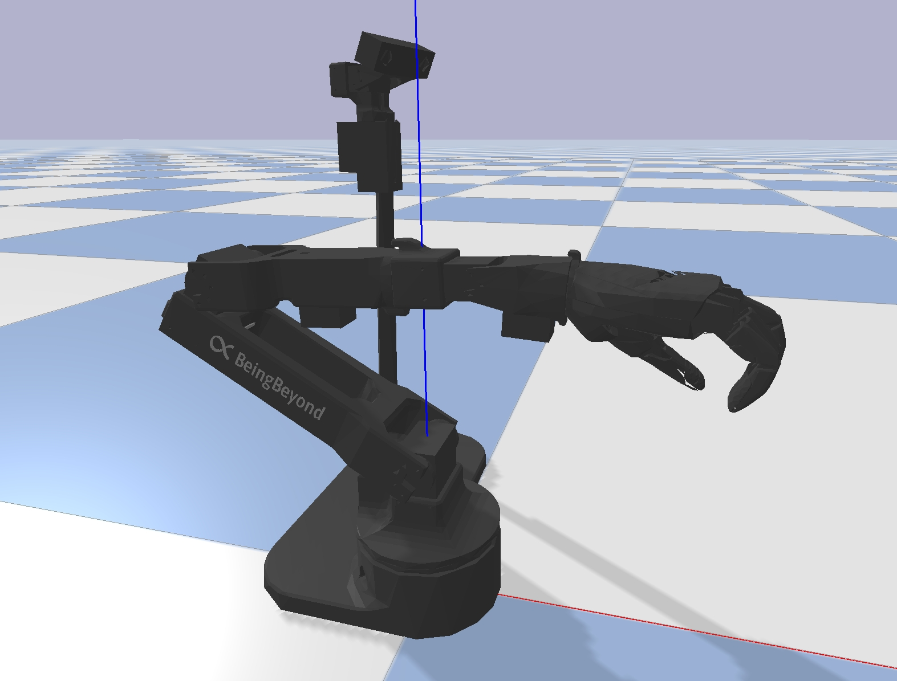

<p align="center">
  
</p>

# BeingBeyond D1 EDU SDK Examples

This directory provides the BeingBeyond D1 education-version SDK wheel,
example Python scripts, and basic guidance for environment setup,
hardware connections, and first-time troubleshooting.

> **WARNING**<br>
> Keep the physical emergency stop button within reach at all times.
> Press it immediately if the robot motion looks unsafe.

---

## 1. Requirements

### 1.1 Hardware

- BeingBeyond D1 EDU robot
  - Head + arm controller
  - DexHand
  - USB stereo RGB camera
- Optional teleoperation devices
  - arm exoskeleton
  - glove
- Linux PC, tested on Ubuntu 20.04 / 22.04
- USB ports for robot controller, RGB camera, exoskeleton, and glove
- CAN interface for DexHand, usually `can0`

### 1.2 Software

- Python 3.10
- Conda
- OpenCV for RGB display
- PyBullet for simulation teleoperation
- Pre-built SDK wheel in `lib/`:

```text
lib/beingbeyond_d1_edu_sdk-0.2.0-cp310-cp310-linux_x86_64.whl
```

The recommended dependencies are listed in `environment.yml` and
`requirements.txt`.

---

## 2. Installation

Run all commands from the `Beingbeyond_D1_edu` directory.

### 2.1 Create Conda Environment

```bash
conda env create -f environment.yml
conda activate d1_edu
```

### 2.2 Install the SDK Wheel

```bash
pip install -U pip
pip install lib/beingbeyond_d1_edu_sdk-0.2.0-cp310-cp310-linux_x86_64.whl
```

### 2.3 Install or Refresh Dependencies

If you did not use `environment.yml`, or want to refresh dependencies:

```bash
pip install -r requirements.txt
pip install opencv-python pybullet
```

---

## 3. Device Defaults

The examples use these default device paths:

| Device | Default |
| --- | --- |
| Head + arm controller | `/dev/ttyACM0` |
| DexHand CAN interface | `can0` |
| USB stereo RGB camera | `/dev/video2` |
| Arm exoskeleton | `/dev/ttyUSB0` |
| Glove | `/dev/ttyACM1` |

If your machine assigns different device names, edit the constants near the
top of the corresponding example file. For examples that use `D1Robot`, set
`vision_device` when creating `D1Robot`.

---

## 4. USB, Serial, and CAN Permissions

### 4.1 Check USB Serial Devices

```bash
ls /dev/ttyACM*
ls /dev/ttyUSB*
ls /dev/video*
```

Expected devices for the default examples:

```text
/dev/ttyACM0
/dev/ttyUSB0
/dev/ttyACM1
/dev/video2
```

If a USB serial device does not appear, reconnect the cable. On Ubuntu,
`brltty` can sometimes occupy serial adapters:

```bash
sudo apt remove brltty
```

Then reconnect the USB device and check again.

### 4.2 Fix Serial Permission Errors

If you see an error similar to:

```text
RuntimeError: Failed to open port /dev/ttyACM0
```

check device permissions:

```bash
ls -l /dev/ttyACM0
ls -l /dev/ttyUSB0
groups
```

If the device belongs to the `dialout` group and your user is not in that
group:

```bash
sudo usermod -aG dialout $USER
```

Then log out and log back in, or run:

```bash
newgrp dialout
```

### 4.3 Bring Up CAN for DexHand

The SDK tries to bring `can0` up automatically, but manual setup is useful
for troubleshooting:

```bash
sudo ip link set can0 down
sudo ip link set can0 type can bitrate 1000000 restart-ms 100
sudo ip link set can0 up
ip -details link show can0
```

---

## 5. Hardware Setup

1. Power on the robot.
2. Wait for the DexHand to finish its startup calibration.
3. Keep the emergency stop button reachable.
4. Keep the workspace clear before running motion examples.
5. If abnormal motion occurs:

```text
press E-STOP -> stop scripts -> restore pose -> release E-STOP -> retry
```

6. If hand calibration fails:

```text
press E-STOP -> release E-STOP -> retry
```

---

## 6. Running Examples

Run examples from the `examples` directory:

```bash
cd examples
```

### 6.1 DexHand Control

```bash
python 1_control_hand.py
```

Uses `can0`. This verifies DexHand CAN communication, normalized finger
commands, speed, torque, and readback.

After the motion checks, this example opens an OpenCV tactile preview window
for the DexHand 5-finger 4x10 sensor matrices. Press `q` in the tactile window
to exit. The tactile preview requires an SDK build that exposes
`DexHand.read_matrix_touch_4x10`; if you are using an older pre-built wheel,
rebuild/reinstall the SDK from the updated `package/` source before running
this part.

### 6.2 Head + Arm Control

```bash
python 2_control_head_arm.py
```

Uses `/dev/ttyACM0`. This moves each head/arm joint around the initial pose,
one joint at a time.

### 6.3 USB Stereo RGB Viewer

```bash
python 3_show_vision.py
```

Uses `/dev/video2`. This example shows RGB from the side-by-side USB stereo
camera in one OpenCV window. Press `q` in the window to exit.

### 6.4 Full D1 Demo

```bash
python 4_control_d1.py
```

Uses head + arm, DexHand, and USB stereo RGB together. Press `q` in the RGB
window to stop the demo and release resources.

### 6.5 IK Control

```bash
python 5_ik_control.py
```

This example:

- Reads the current head + arm joint state
- Computes the current end-effector pose
- Builds a target pose in the base frame
- Solves iterative arm-only IK
- Sends each IK result to the real robot

### 6.6 Keyboard Teleoperation

```bash
python 6_keyboard_teleop.py
```

> **IMPORTANT**<br>
> Run this example in a real terminal. Raw-keyboard mode may not work in
> PyCharm, VSCode, Jupyter, or other IDE consoles.

Keyboard commands:

```text
Translation:
  w / s : X+ / X-
  a / d : Y+ / Y-
  z / x : Z+ / Z-

Orientation:
  u / o : roll  + / -
  i / k : pitch + / -
  j / l : yaw   + / -

Hand:
  Space : toggle hand position between open and closed

Other:
  r     : reset EE target and joint state
  h     : print help
  q     : quit
```

### 6.7 Teleoperation in Simulation

```bash
python 7_exo_teleop_sim.py
```

Default devices:

- Arm exoskeleton: `/dev/ttyUSB0`
- Glove: `/dev/ttyACM1`

This example loads the D1 URDF in PyBullet, reads the exoskeleton and glove,
and applies the teleoperation vector to the simulated head, arm, and hand.
At startup, keep the arm exoskeleton still in its zero pose until zero
calibration finishes.

### 6.8 Teleoperation on Real Hardware

```bash
python 8_exo_teleop_real.py
```

Default devices:

- Head + arm controller: `/dev/ttyACM0`
- DexHand CAN: `can0`
- Arm exoskeleton: `/dev/ttyUSB0`
- Glove: `/dev/ttyACM1`

This example sends exoskeleton arm motion and glove finger values to the real
D1 robot through the `D1Robot` interface. At startup, keep the arm exoskeleton
still in its zero pose until zero calibration finishes.

---

## 7. Troubleshooting

### No `/dev/ttyACM*` or `/dev/ttyUSB*`

- Reconnect the USB cable.
- Check `lsusb`.
- Remove `brltty` if it is occupying a serial device:

```bash
sudo apt remove brltty
```

### Permission Denied on Serial Port

Add your user to `dialout`:

```bash
sudo usermod -aG dialout $USER
newgrp dialout
```

### DexHand or CAN Fails to Open

Check the CAN interface:

```bash
ip -details link show can0
```

Bring it up manually:

```bash
sudo ip link set can0 down
sudo ip link set can0 type can bitrate 1000000 restart-ms 100
sudo ip link set can0 up
```

### Head + Arm Servo IDs Not Responding

Check that the robot controller is connected to `/dev/ttyACM0`, or update
the `dev` / `arm_dev` value in the example. Also check USB permissions and
power.

### RGB Camera Does Not Open

Check the camera device:

```bash
ls /dev/video*
v4l2-ctl --list-devices
```

To confirm the video source, check the existing `/dev/video*` devices first,
then plug in the robot and compare which new `/dev/video*` device appears.

If the camera is not `/dev/video2`, update `device` in `3_show_vision.py`
or `vision_device` in the example that creates `D1Robot`.

### Exoskeleton or Glove Does Not Open

Check:

```bash
ls /dev/ttyUSB*
ls /dev/ttyACM*
```

Then update:

- `arm_exo_port` in `7_exo_teleop_sim.py` / `8_exo_teleop_real.py`
- `glove_port` in `7_exo_teleop_sim.py` / `8_exo_teleop_real.py`

### Hand Motion Looks Misaligned

- Power cycle the robot and wait for DexHand calibration.
- Keep fingers open and unobstructed during startup.
- Verify the glove zero calibration posture before teleoperation.

---

## 8. License

MIT. See `LICENSE`.
